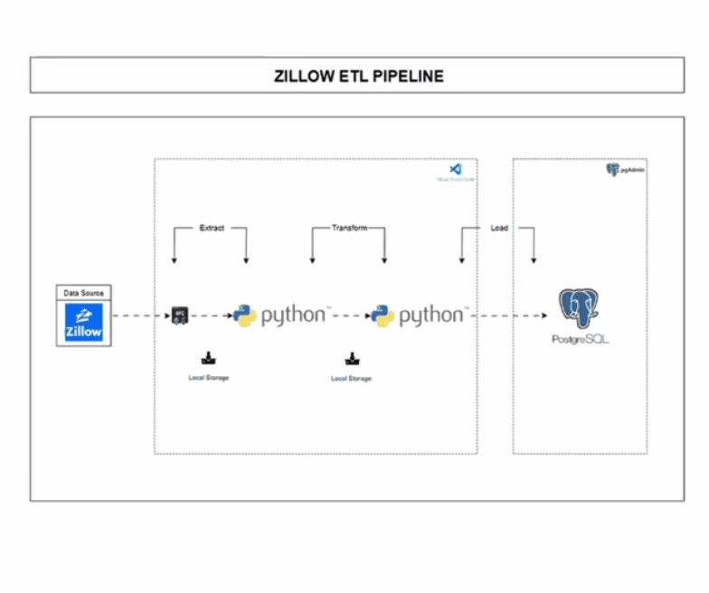

# Zillow ETL Pipeline
This project is a complete end-to-end data engineering pipeline designed to collect, clean, transform, and store real estate data from Zillow using a public API. The goal is to automate the daily extraction of agent-listed properties in Houston, Texas, enrich the data through cleaning and transformation, and load it into a structured database for future analytics, machine learning, or reporting. The project demonstrates how real-world pipelines work, from raw API data, through storage/landing, transformation, and finally into a reliable data storage system for downstream purposes.
## Limitation
Due to API quota limits, this project uses only a single page of 25 records, making it impossible for daily automation; however, the pipeline is fully designed to handle larger datasets efficiently when more data is available.
## Architecture Diagram

## Detailed Workflow
- Extract Data
	- A request is sent to the Zillow API using Python,  which returns a nested JSON containing property listings.
	- The response is stored locally inside
    
- Data Storage (Landing Zone)
	- The raw JSON file is saved locally in [raw_data](data/raw_data/2025-11-18)before any transformation.
	- This preserves the original data and mimics a typical cloud landing zone.
   
- Data Transformation
  - The raw JSON is processed using Pandas:
  - Flatten nested keys into a clean table.
  - Select relevant fields (address, price, beds, baths, coordinates, etc.).
  - Convert datatypes to their proper formats
  - Output becomes an analysis-ready DataFrame.
  - A custom `ZillowDataCleaner` class was created to structure and modularize the entire transformation logic.

- Loading
   - A connection is created between Python and PostgreSQL using psycopg2
   - A target table is created with the appropriate schema.
   - The cleaned data is copied into PostgreSQL from `local storage`
   - This makes the data persistent, queryable, and ready for downstream usage.

- Data Serving
  - Once stored in PostgreSQL: It becomes a system of house listing records and SQL queries can be executed for insights.
  - The data can be connected to BI tools like Power BI / Tableau.
